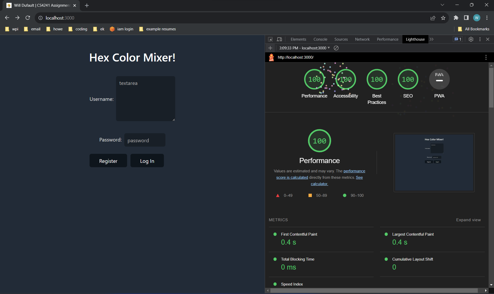
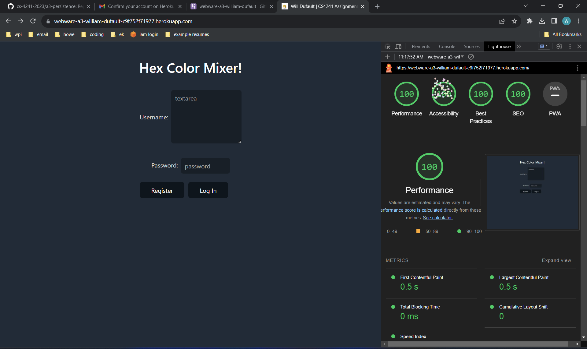

Hex Mixer! (Will Dufault)

https://webware-a3-william-dufault-c9f752f71977.herokuapp.com/

---

# Basic Requirements

---

### A2 Requirements

- I still follow all of these

### Server

- I used Express to host a server (server.js)

### Results

- I show the current user's name and all of (only) their data from the MongoDB database in the table

### Form/Entry

- I allow users to add (submit), modify (lighten, darken), and delete (clear) data on their account

### Persistent storage

- I used MongoDB Atlas to host a database with multiple persistent collections

### CSS Framework or Template

- I use the water.css template from the GitHub repository linked in the A3 repository
- Water.css is very clean and uses some very safe colors (different shades of blue), which fit my 
  application well because it provides a good amount of contrast with the white text and borders 
  around color previews

### HTML

- I use a textarea, a text input, and a password input
- I only show data for the current user
- I only use one page, I show/hide the log in wrapper and main application wrapper

### CSS

- I used the water.css template for most of the styling
- I used a small custom reset.css file (not really a reset, just removes default margins and 
  padding)
- I used a custom style.css file with some additional styles I defined for the page

### JavaScript

- My main.js file has functions that fetches data from my Express server

### Node.js

- I use Express for the server and MongoDB for the persistent database

### General

- I achieve at least 90% on performance, best practices, accessibility, and seo using lighthouse
  (100% on each)

---

# Achievements

---

### Technical

- My app is hosted on heroku
	- The process of getting it up and running on heroku was pretty straightforward. Although, I did
	  run into issues with it not being able to access my MongoDB database, so I just enabled quad
	  zero access to the database because I don't know if heroku uses static ips or not for user 
	  apps. I also ran into the issue of not setting a start script in `package.json` and having to 
	  set `port = process.env.PORT || 3000` in `server.js`.
- My page gets 100% in all four lighthouse categories
- localhost:

- heroku:

(only going for 90 points)